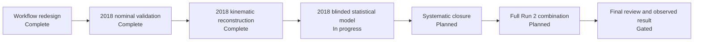

# WW Run 2 Leptonic PPS — Analysis Status

Public, high-level progress dashboard for a Run 2 leptonic diboson analysis with forward proton tagging.

**Public dashboard:** https://jgomespi.github.io/WWRun2LeptonicPPS-Analysis-Status/  
**Current phase:** 2018 blinded statistical-model construction.  
**Milestone progress:** 3 of 7 major phases complete; phase 4 is active.  
**Last updated:** 20 August 2026.

## Public scope

This repository is intentionally limited to project-management information. It does **not** publish analysis code, storage paths, event counts, yields, selection thresholds, fitted numerical results, limits, coupling values, dataset inventories, internal review material, or other unpublished analysis details.

The public dashboard is designed to answer one question: **where is the analysis in the workflow?**

## Milestones

| Phase | Status | High-level deliverable |
|---|---|---|
| 1. Scalable workflow and reproducibility | ✅ Complete | Partitioned processing, provenance, bounded-memory execution |
| 2. 2018 nominal analysis and validation | ✅ Complete | Nominal reconstruction, control-region validation, blinded signal-region handling |
| 3. 2018 kinematic reconstruction | ✅ Complete | Signal-region kinematic reconstruction and completeness audit closed |
| 4. 2018 blinded statistical model | 🔵 In progress | Validate systematic inputs, build templates, datacards, workspace and expected-only inference |
| 5. Full systematic closure | ⏳ Planned | Validate detector, reconstruction and normalization uncertainties |
| 6. Full Run 2 combination | ⏳ Planned | Extend to all Run 2 periods and audit inter-year correlations |
| 7. Final review and observed result | 🔒 Gated | Freeze the analysis, complete review, then proceed to approved unblinding |

## Workflow

## Current focus

The 2018 signal-region kinematic reconstruction is complete and audited. Before freezing the first blinded templates, a systematic-input consistency audit identified a correction needed in a derived uncertainty treatment while leaving the central nominal reconstruction unchanged. The correction has been validated and is being propagated through a fresh 2018 derived production. The next gate is closure of that regenerated sample, followed by blinded templates and expected-only inference.

## Status policy

This public status page is updated only when a major project-management milestone changes state or when the active gate within a milestone materially changes. Technical details remain in the private analysis repository.

### Status legend

- ✅ **Complete** — milestone closed for the current scope.
- 🔵 **In progress** — active production or validation.
- ⏭ **Next** — immediate downstream milestone.
- ⏳ **Planned** — scheduled after earlier gates close.
- 🔒 **Gated** — requires analysis freeze/review approval before proceeding.

## GitHub Pages

The site is deployed from this repository using GitHub Actions and is intended to remain a sanitized public project-status view only.
