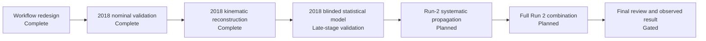

# WW Run 2 Leptonic PPS — Analysis Status

Public, high-level progress dashboard for a Run 2 leptonic diboson analysis with forward proton tagging.

**Public dashboard:** https://jgomespi.github.io/WWRun2LeptonicPPS-Analysis-Status/  
**Current phase:** 2018 blinded statistical-model validation.  
**Milestone progress:** 3 of 7 major phases complete; phase 4 is in late-stage validation.  
**Last updated:** 9 September 2026.

## Public scope

This repository is intentionally limited to project-management information. It does **not** publish analysis code, storage paths, event counts, yields, selection thresholds, fitted numerical results, limits, coupling values, dataset inventories, internal review material, or other unpublished analysis details.

The public dashboard is designed to answer one question: **where is the analysis in the workflow?**

## Milestones

| Phase | Status | High-level deliverable |
|---|---|---|
| 1. Scalable workflow and reproducibility | ✅ Complete | Partitioned processing, provenance, bounded-memory execution |
| 2. 2018 nominal analysis and validation | ✅ Complete | Nominal reconstruction, control-region validation, blinded signal-region handling |
| 3. 2018 kinematic reconstruction | ✅ Complete | Signal-region kinematic reconstruction and completeness audit closed |
| 4. 2018 blinded statistical model | 🔵 In progress | Complete systematic model, combined workspaces, expected-only limits and background-only Asimov fit closure are operational; final statistical diagnostics remain |
| 5. Full systematic closure | ⏳ Planned | Validate detector, reconstruction, migration and normalization uncertainties across Run 2 |
| 6. Full Run 2 combination | ⏳ Planned | Extend to all Run 2 periods and audit inter-year correlations |
| 7. Final review and observed result | 🔒 Gated | Freeze the analysis, complete review, then proceed to approved unblinding |

## Workflow

## Current focus

The 2018 publication model now includes the accepted detector, reconstruction, migration, forward-proton and statistical uncertainty treatments required by the current analysis scope. Per-channel and combined statistical models are reproducible, expected-only inference is operational, and the background-only Asimov fit closes successfully while the observed signal region remains blinded.

The remaining 2018 work is concentrated in the final statistical-validation layer: explicit profile-likelihood scans, nuisance pulls and impacts, pre/post-fit validation plots, goodness-of-fit, channel-consistency checks, sparse-bin/MC-statistical stability, and the final provenance freeze. Once these gates pass, 2018 can be considered technically publication-complete while still blinded.

Production provenance for the completed 2018 campaigns is maintained in the private analysis workflow so reconstruction, systematic propagation, template construction and statistical validation remain traceable and reproducible.

## Status policy

This public status page is updated only when a major project-management milestone changes state or when the active gate within a milestone materially changes. Technical details remain in the private analysis repository.

### Status legend

- ✅ **Complete** — milestone closed for the current scope.
- 🔵 **In progress** — active production or validation.
- ⏭ **Next** — immediate downstream milestone.
- ⏳ **Planned** — scheduled after earlier gates close.
- 🔒 **Gated** — requires analysis freeze/review approval before proceeding.

## GitHub Pages

The site is deployed from this repository using GitHub Actions and is intended to remain a sanitized public project-status view only.
