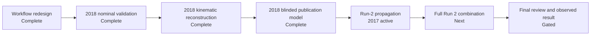

# WW Run 2 Leptonic PPS — Analysis Status

Public, high-level progress dashboard for a Run 2 leptonic diboson analysis with forward proton tagging.

**Public dashboard:** https://jgomespi.github.io/WWRun2LeptonicPPS-Analysis-Status/  
**Current phase:** Full Run 2 propagation — 2017 processing and normalization validation.  
**Milestone progress:** 4 of 7 major phases complete; phase 5 is in progress.  
**Last updated:** 30 September 2026.

## Public scope

This repository is intentionally limited to project-management information. It does **not** publish analysis code, storage paths, event counts, yields, selection thresholds, fitted numerical results, limits, coupling values, dataset inventories, internal review material, or other unpublished analysis details.

The public dashboard is designed to answer one question: **where is the analysis in the workflow?**

## Milestones

| Phase | Status | High-level deliverable |
|---|---|---|
| 1. Scalable workflow and reproducibility | ✅ Complete | Partitioned processing, provenance, bounded-memory execution |
| 2. 2018 nominal analysis and validation | ✅ Complete | Nominal reconstruction, control-region validation, blinded signal-region handling |
| 3. 2018 kinematic reconstruction | ✅ Complete | Signal-region kinematic reconstruction and completeness audit closed |
| 4. 2018 blinded publication model | ✅ Complete | Statistical model, systematic treatment, expected-only validation and blinded provenance freeze closed |
| 5. Full Run 2 propagation | 🔵 In progress | Apply the frozen 2018 architecture to 2017 and 2016, including normalization and systematic bookkeeping |
| 6. Full Run 2 combination | ⏭ Next | Combine validated Run 2 periods and audit inter-year correlations |
| 7. Final review and observed result | 🔒 Gated | Freeze the analysis, complete review, then proceed to approved unblinding |

## Workflow

```mermaid
flowchart LR
    A[Workflow redesign\nComplete] --> B[2018 nominal validation\nComplete]
    B --> C[2018 kinematic reconstruction\nComplete]
    C --> D[2018 blinded publication model\nComplete]
    D --> E[Run-2 propagation\n2017 active]
    E --> F[Full Run 2 combination\nNext]
    F --> G[Final review and observed result\nGated]
```

## Current focus

The 2018 analysis is now technically publication-complete while remaining blinded. Its nominal processing, kinematic reconstruction, systematic-uncertainty treatment, statistical model, expected-only validation, channel-consistency checks, goodness-of-fit studies and deterministic provenance freeze are closed.

The active work is the propagation of that frozen architecture to the remaining Run 2 periods. The 2017 workflow has completed its main raw-processing and calibration stages and is currently closing generator-level normalization bookkeeping before the final 2017 normalization contract and nominal derived production are frozen. The same validated contracts will then be propagated to 2016.

This stage is deliberately conservative: the analysis reuses the accepted 2018 architecture rather than redesigning year-specific workflows. Publicly relevant progress is therefore measured by closure of reproducibility, normalization, systematic and combination gates rather than by individual batch jobs or internal dataset details.

Observed signal-region data remain blinded. No observed fit or observed limit is part of the current workflow.

## Status policy

This public status page is updated only when a major project-management milestone changes state or when the active gate within a milestone materially changes. Technical details remain in the private analysis repository.

### Status legend

- ✅ **Complete** — milestone closed for the current scope.
- 🔵 **In progress** — active production or validation.
- ⏭ **Next** — immediate downstream milestone.
- ⏳ **Planned** — scheduled after earlier gates close.
- 🔒 **Gated** — requires analysis freeze/review approval before proceeding.

## GitHub Pages

The site is deployed from this repository using GitHub Actions and is intended to remain a sanitized public project-status view only.
